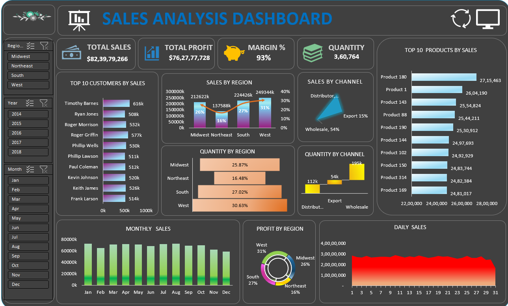

## 📊 Sales Performance Analysis Dashboard (Excel Capstone Project)  

## 📌 Project Overview

This project showcases an **interactive Sales Analysis Dashboard built in Microsoft Excel**, designed to track and analyze key business sales metrics such as **Total Sales, Profit, Margin %, Quantity Sold, Regional Performance, Customer Insights, and Product Trends**.

The dashboard enables business stakeholders to quickly identify:

* High-performing regions
* Top customers and products
* Sales distribution across channels
* Monthly and daily sales trends
* Profit contribution by region

## 🎯 Project Objectives

* Build an executive-level sales dashboard in Excel
* Monitor sales and profit performance across regions
* Identify top customers and best-selling products
* Analyze sales by distribution channels
* Track monthly and daily sales trends
* Provide slicers for interactive filtering

## 📊 Dataset  -->>>>

- <a href="https://github.com/dimple-shah-au13/Sales-Performance-Analysis-Excel-Dashboard/blob/main/Excel%20Project.xlsx">Dataset</a>

### Key Columns Included

* OrderDate (Year, Month, Day)
* RegionName (Midwest, Northeast, South, West)
* CustomersName
* ProductsName / Product Description Index
* Line Total (Sales / Revenue)
* Unit Price (Selling price of 1 item)
* Profit 
* Profit margin %
* Order Quantity
* Channel (Wholesale, Distributor, Export)

## 🛠 Tools & Technologies Used

* **Microsoft Excel**
* Pivot Tables & Pivot Charts
* Slicers & Timeline Filters
* Excel Formulas & Calculations
* Conditional Formatting
* Data Cleaning & Transformation

## 🧹 Data Cleaning Process
1. Converted first row into headers and standardized column names.
2. Removed duplicate records using Excel Remove Duplicates feature.
3. Handled missing values in sales, quantity, and date fields.
  Actions:
  Replace missing numeric values with 0 (if logical)
  Remove rows with missing Order Date
4. Fixed date formats and ensured date recognition.
5. Cleaned text fields using TRIM and CLEAN functions.
  Actions:
  =TRIM(CLEAN(A2))
  =TRIM(CLEAN([@[Customer Names]]))
  Used for: Customer Name, Product, Region
6. Create helper columns :
   * Customer Names -- new column in Sales_Data
   =INDEX(Customers!C:C, MATCH(E2, Customers!A:A, 0))

   * gives region name  == west
   =IFERROR(
     INDEX(
       State_Regions!C:C,
       MATCH(
         TRIM(INDEX(Regions!D:D, MATCH(I5, Regions!A:A, 0))),
         State_Regions!A:A,
         0
       )
     ),
     "Region Not Found"
   )

   * Product Names -- new column in Sales_Data
    =INDEX(Products!B:B, MATCH(J2, Products!A:A, 0)) 

 7. New Columns Created (Calculated Fields)
   * Profit = Line Total − Total Unit Cost
   * Profit Margin = (Profit ÷ Line Total) × 100
   * Unit Cost  =ROUNDUP(N2/K2, 2)
   *  =YEAR(Sales_Data5[@OrderDate])
   *  =TEXT(Sales_Data5[@OrderDate],"MMM")
   *  =DAY(Sales_Data5[@OrderDate])

## 🔑 Key Performance Indicators (KPIs)

| KPI                     | Value   |
| ----------------------- | ------- |
| **Total Sales**         | $82.39M |
| **Total Profit**        | $76.27M |
| **Margin %**            | 93%     |
| **Total Quantity Sold** | 360,764 |

## 📈 Dashboard Components & Visuals

### 1️⃣ Top 10 Customers by Sales

**Visual:** Horizontal Bar Chart
**Insights:**
* Highlights most valuable customers
* Supports customer retention and loyalty strategies

### 2️⃣ Sales by Region

**Visual:** Column + Line Chart
**Insights:**
* West region contributes the highest sales share (~31%)
* Northeast has the lowest regional contribution (~16%)

### 3️⃣ Sales by Channel

**Visual:** Radar Chart
**Channel Distribution:**
- Wholesale: 54%
- Export: 15%
- Distributor: 31%
**Insights:**
* Wholesale is the dominant revenue channel

### 4️⃣ Top 10 Products by Sales

**Visual:** Bar Chart
**Insights:**
* Identifies best-selling products
* Useful for inventory and marketing planning

### 5️⃣ Quantity by Region

**Visual:** Funnel Chart
**Insights:**
* West leads in quantity sold (30.63%)
* Midwest and South follow closely  b    

### 6️⃣ Quantity by Channel

**Visual:** Waterfall Chart
**Insights:**
* Wholesale channel has the highest quantity volume
* Export contributes the least quantity

### 7️⃣ Monthly Sales Trend

**Visual:** Column Chart
**Insights:**
* Consistent sales across months
* Seasonal peaks visible during mid-year months

### 8️⃣ Profit by Region

**Visual:** Donut Chart
**Insights:**
* West region generates the highest profit (31%)
* Northeast shows lower profitability

### 9️⃣ Daily Sales Trend

**Visual:** Area Chart
**Insights:**
* Sales remain stable across days
* Minor fluctuations suggest steady demand

## 🎛 Interactive Filters (Slicers)

The dashboard includes slicers for:
* **Region** (Midwest, Northeast, South, West)
* **Year** (2014–2018)
* **Month** (Jan–Dec)
These filters allow users to drill down into specific sales segments.

## 📊 Excel Dashboard Interaction -->>>>

- <a href="https://github.com/dimple-shah-au13/Sales-Performance-Analysis-Excel-Dashboard/blob/main/Images/Excel-Dashboard.png">View Sales Dashboard</a>

## 🔍 Business Insights & Recommendations

* Focus marketing efforts on **West and South regions** for maximum returns
* Strengthen Wholesale partnerships as it drives majority of sales
* Develop retention strategies for top customers
* Optimize inventory based on top-selling products
* Explore growth opportunities in Northeast region
* Sales show strong seasonal patterns.

## 🚀 How to Use This Project

1. Download the repository
2. Open **Excel Project.xlsx**
3. Enable editing and refresh Pivot Tables
4. Use slicers to interact with the dashboard
5. Explore insights by region, year, and month

## 📷 Dashboard Preview

Here’s a preview of the interactive dashboard:

## 👤 Author

**Dimple Shah**  
Data Analyst | Excel | Power BI | Tableau | SQL | Python | Business Intelligence Enthusiast

## GITHUB -->>>>

- <a href ="https://github.com/dimple-shah-au13/Sales-Performance-Analysis-Excel-Dashboard/tree/main">GITHUB</a>

## ⭐ Support

If you like this project, don’t forget to ⭐ star the repository on GitHub!

    
